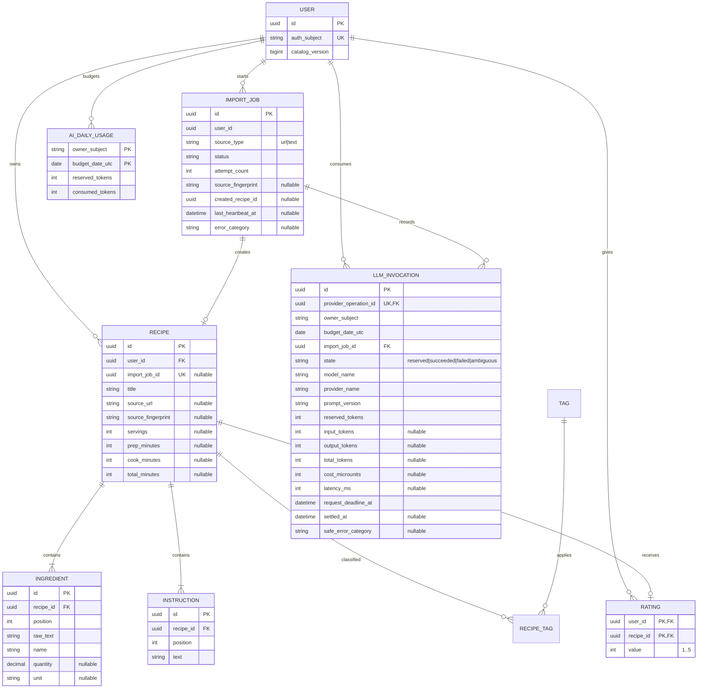

# Minimal data model

This is the logical data contract. Physical changes are managed through Alembic
revisions; IDs are UUIDs and timestamps are timezone-aware.

`catalog_version` is incremented in the same catalog transaction as recipe/rating
changes. Catalog enforces unique `(user_id, import_job_id)` for replay safety.
Ingestion owns active URL import-job uniqueness; Catalog owns current recipe-source
existence for each user.

`AI_DAILY_USAGE` is keyed by owner subject and UTC budget date. Reservations increase
`reserved_tokens` before an invocation; settled invocations move actual usage into
`consumed_tokens`. UTC midnight creates the next budget row, keeping daily limits
independent of local time zones. `LLM_INVOCATION` is durable per provider operation so
ambiguous outcomes can be reconciled without spending a second reservation.
