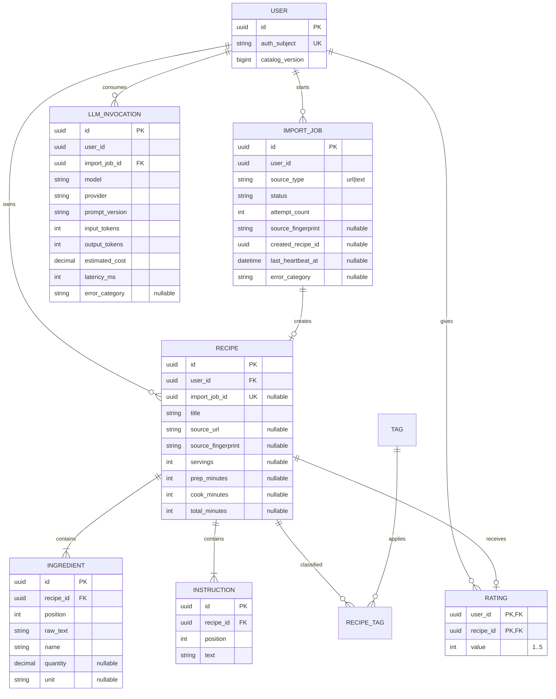

# Minimal data model

This is the logical data contract. Physical changes are managed through Alembic
revisions; IDs are UUIDs and timestamps are timezone-aware.

`catalog_version` is incremented in the same catalog transaction as recipe/rating
changes. Catalog enforces unique `(user_id, import_job_id)` for replay safety.
